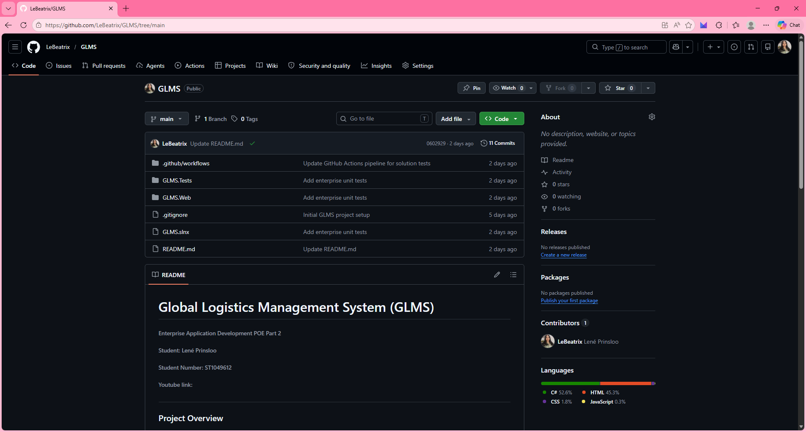
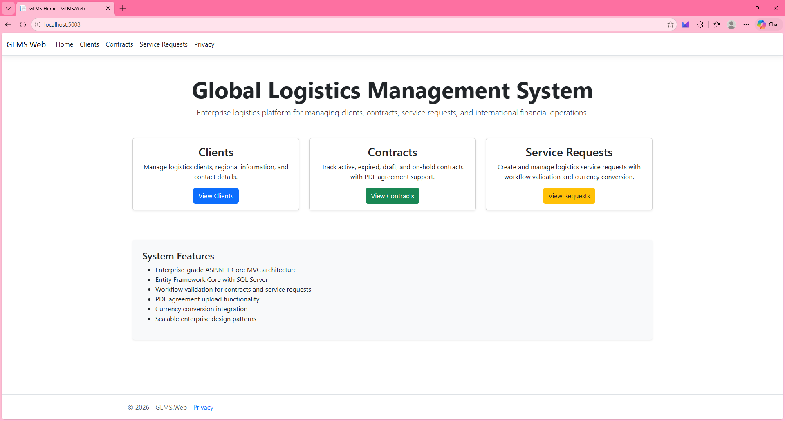
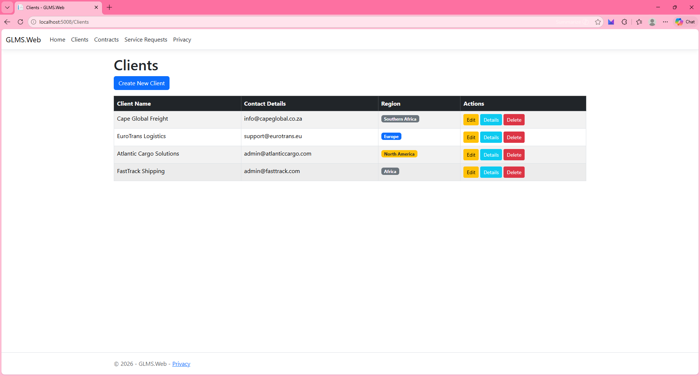
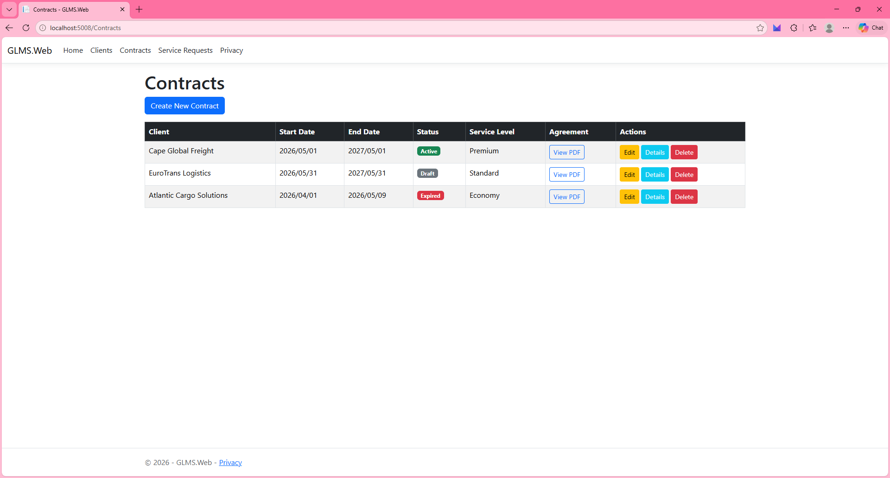
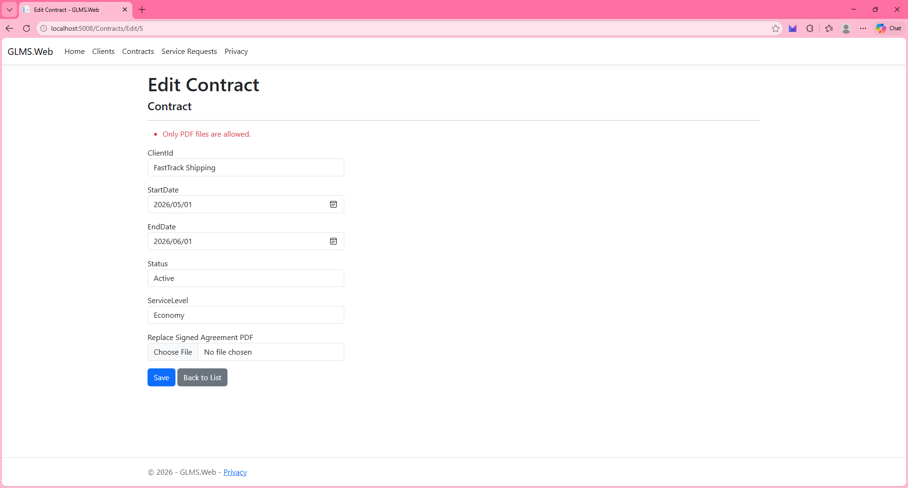
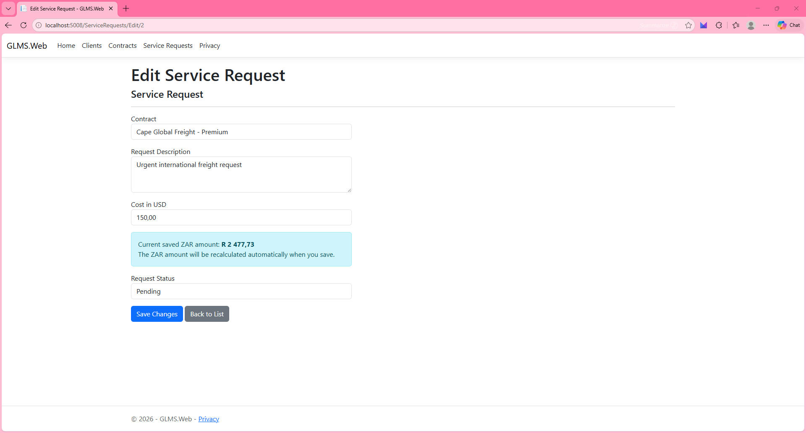
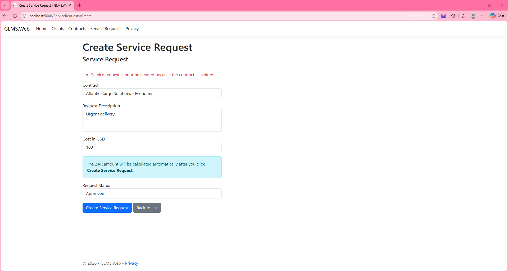
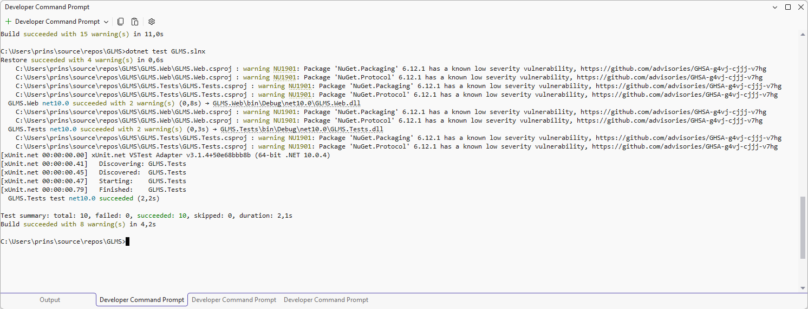
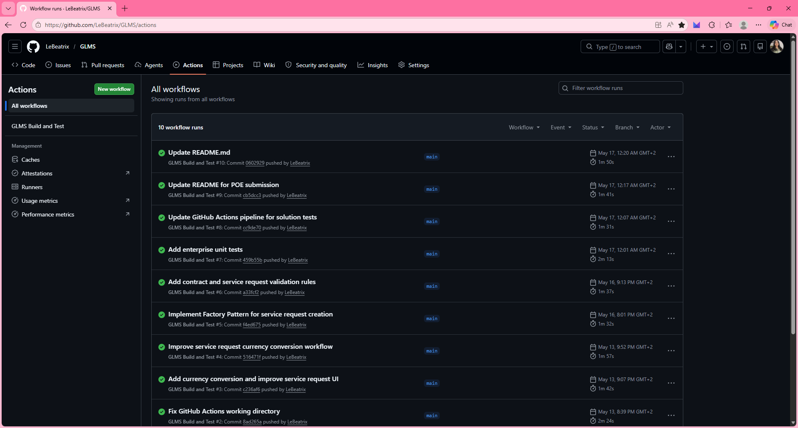

# Global Logistics Management System (GLMS)

###### Enterprise Application Development POE Part 2

###### Student: Lené Prinsloo

###### Student Number: ST10496124

###### YouTube Demonstration Link:
https://youtu.be/Bd9NwPr0DGY 

---

# Project Overview

GLMS is an ASP.NET Core MVC enterprise prototype developed for TechMove Logistics.

The system manages:
- Clients
- Contracts
- Service Requests
- PDF Agreement Uploads
- Workflow Validation
- Currency Conversion
- Automated Testing

The project demonstrates enterprise software development principles using ASP.NET Core MVC, Entity Framework Core, SQL Server, GitHub Actions CI/CD, and multiple enterprise design patterns.

---

# Technologies

- ASP.NET Core MVC
- Entity Framework Core
- SQL Server LocalDB
- Bootstrap
- xUnit
- GitHub Actions
- HttpClient API Integration

---

# Features

- Client CRUD management
- Contract CRUD management
- Service Request CRUD management
- PDF agreement upload for contracts
- Contract workflow validation
- Blocks service requests for:
  - Draft contracts
  - Expired contracts
  - On Hold contracts
- USD to ZAR currency conversion using an external API
- Unit testing for:
  - Currency calculation
  - File validation
  - Workflow validation
- GitHub Actions CI/CD pipeline

---

# Design Patterns Implemented

## MVC Pattern
Separates:
- Models
- Views
- Controllers

Improves maintainability and scalability.

---

## Strategy Pattern
Used for currency conversion.

### Classes
- `ICurrencyConverter`
- `UsdToZarConverter`

Allows future currency strategies without modifying controller logic.

---

## Observer Pattern
Used for service request status notifications.

### Classes
- `IServiceRequestObserver`
- `ServiceRequestLogger`

Logs service request workflow updates.

---

## Factory Pattern
Used for centralized service request object creation.

### Classes
- `IServiceRequestFactory`
- `ServiceRequestFactory`

Improves scalability and object creation management.

---

## Dependency Injection
ASP.NET Core dependency injection is used throughout the application for:
- Services
- Validators
- Observers
- Factories

---

# Database Migration Scripts

## Initial Database Setup

```bash
Add-Migration InitialCreate
Update-Database
```

## Additional Migrations

```bash
Add-Migration AddContractValidation
Add-Migration AddCurrencyConversion
Update-Database
```

---

# How to Run the Application

## 1. Clone Repository



```bash
git clone https://github.com/LeBeatrix/GLMS.git
```

---

## 2. Open Solution

Open:

```text
GLMS.slnx
```

in Visual Studio.

---

## 3. Update Database

```bash
dotnet ef database update --project GLMS.Web
```

---

## 4. Run Application

```bash
dotnet run --project GLMS.Web
```

---

# How to Run Tests

```bash
dotnet test GLMS.slnx
```

---

# Example Test Data

## Clients

### Client 1

```text
Name: Cape Global Freight
Contact: support@capeglobal.co.za
Region: South Africa
```

### Client 2

```text
Name: EuroTrans Logistics
Contact: operations@eurotrans.eu
Region: Europe
```

### Client 3

```text
Name: Atlantic Cargo Solutions
Contact: contact@atlanticcargo.com
Region: North America
```

---

# Validation Features

## Contract Validation
- End date must be after start date
- Signed PDF agreement required
- Only PDF files accepted

---

## Service Request Validation
Service requests cannot be created for:
- Expired contracts
- Draft contracts
- On Hold contracts

---

# Screenshots

## Home Page



---

## Clients Management



---

## Contract Management



---

## PDF Upload Validation



---

## Currency Conversion



---

## Workflow Validation



---

## Unit Testing



---

## GitHub Actions Pipeline



---

# Unit Testing

The application uses xUnit testing.

Tests include:
- Currency conversion tests
- File validation tests
- Workflow validation tests

---

# CI/CD Pipeline

GitHub Actions automatically:
- Restores dependencies
- Builds the solution
- Runs unit tests

This ensures continuous integration and automated quality assurance.

---

# References

Microsoft, 2025. ASP.NET Core documentation. [online] Available at: <https://learn.microsoft.com/aspnet/core> [Accessed 18 May 2026].

Microsoft, 2025. Entity Framework Core documentation. [online] Available at: <https://learn.microsoft.com/ef/core/> [Accessed 18 May 2026].

Microsoft, 2025. Dependency injection in ASP.NET Core. [online] Available at: <https://learn.microsoft.com/aspnet/core/fundamentals/dependency-injection> [Accessed 18 May 2026].

Microsoft, 2025. File uploads in ASP.NET Core. [online] Available at: <https://learn.microsoft.com/aspnet/core/mvc/models/file-uploads> [Accessed 18 May 2026].

Microsoft, 2025. Unit testing C# with xUnit. [online] Available at: <https://learn.microsoft.com/dotnet/core/testing/unit-testing-csharp-with-xunit> [Accessed 18 May 2026].

GitHub, 2025. GitHub Actions documentation. [online] Available at: <https://docs.github.com/actions> [Accessed 18 May 2026].

Refactoring Guru, 2025. Strategy Design Pattern. [online] Available at: <https://refactoring.guru/design-patterns/strategy> [Accessed 18 May 2026].

Refactoring Guru, 2025. Observer Design Pattern. [online] Available at: <https://refactoring.guru/design-patterns/observer> [Accessed 18 May 2026].

Refactoring Guru, 2025. Factory Method Design Pattern. [online] Available at: <https://refactoring.guru/design-patterns/factory-method> [Accessed 18 May 2026].

ExchangeRate-API, 2025. Exchange rate API documentation. [online] Available at: <https://www.exchangerate-api.com/> [Accessed 18 May 2026].

Bootstrap, 2025. Bootstrap documentation. [online] Available at: <https://getbootstrap.com/docs/> [Accessed 18 May 2026].
