# Global Logistics Management System (GLMS)

## Enterprise Application Development POE

### Student Information

**Student:** Lené Prinsloo
**Student Number:** ST10496124

### Demonstration Videos

**Demo 1 – Core Functionality**
https://youtu.be/Bd9NwPr0DGY

**Demo 2 – Docker, API, JWT Authentication and Integration Testing**
https://youtu.be/0uK6imMx-io

---

# Project Overview

The Global Logistics Management System (GLMS) is an enterprise logistics management solution developed for TechMove Logistics using ASP.NET Core, Entity Framework Core, SQL Server, Docker, and RESTful APIs.

The system enables logistics administrators to manage:

* Clients
* Contracts
* Service Requests
* Contract Agreements (PDF Uploads)
* Currency Conversion
* Workflow Validation
* JWT Authentication
* API Integration
* Docker Container Deployment

The solution demonstrates modern enterprise application development practices, including layered architecture, design patterns, CI/CD automation, containerization, automated testing, and secure API communication.

---

# Solution Architecture

The solution consists of three main components:

### GLMS.Web

ASP.NET Core MVC Frontend Application

Responsibilities:

* User Interface
* Authentication
* Client Management
* Contract Management
* Service Request Management
* API Consumption

### GLMS.API

ASP.NET Core Web API

Responsibilities:

* REST Endpoints
* JWT Authentication
* Business Logic
* Database Access
* Entity Framework Core

### GLMS.Tests

xUnit Test Project

Responsibilities:

* Unit Testing
* Integration Testing
* API Endpoint Validation
* Authentication Testing

---

# Technologies Used

* ASP.NET Core MVC
* ASP.NET Core Web API
* Entity Framework Core
* SQL Server
* Docker
* Docker Compose
* JWT Authentication
* Bootstrap 5
* xUnit
* GitHub Actions
* HttpClient
* Swagger/OpenAPI

---

# Features

## Client Management

* Create Clients
* View Clients
* Edit Clients
* Delete Clients

---

## Contract Management

* Create Contracts
* Edit Contracts
* Delete Contracts
* Upload PDF Agreements
* Contract Status Tracking

Supported statuses:

* Draft
* Active
* On Hold
* Expired

---

## Service Request Management

* Create Service Requests
* Track Request Status
* Currency Conversion
* Workflow Validation

Business rules prevent service requests from being created when:

* Contract is Draft
* Contract is On Hold
* Contract is Expired

---

## JWT Authentication

The API is secured using JWT Bearer Tokens.

Features include:

* Secure Login Endpoint
* Token Generation
* Authorization Protection
* Swagger JWT Support
* MVC to API Authentication Flow

---

## Currency Conversion

The system integrates with an external exchange-rate API to convert:

USD → ZAR

This demonstrates external service integration and API consumption.

---

## Docker Deployment

The application is fully containerized using Docker.

Containers:

* sql-server-db
* glms-backend-api
* glms-frontend-web

Benefits:

* Consistent environments
* Easy deployment
* Simplified testing
* Cloud-ready architecture

---

# Design Patterns Implemented

## MVC Pattern

Separates:

* Models
* Views
* Controllers

Benefits:

* Maintainability
* Separation of Concerns
* Scalability

---

## Strategy Pattern

Used for currency conversion.

Classes:

* ICurrencyConverter
* UsdToZarConverter

Benefits:

* Open/Closed Principle
* Easy future currency additions

---

## Observer Pattern

Used for service request event notifications.

Classes:

* IServiceRequestObserver
* ServiceRequestLogger

Benefits:

* Decoupled notifications
* Event monitoring

---

## Factory Pattern

Used for service request object creation.

Classes:

* IServiceRequestFactory
* ServiceRequestFactory

Benefits:

* Centralized object creation
* Improved maintainability

---

## Dependency Injection

Used throughout the application for:

* Services
* Validators
* API Clients
* Observers
* Factories

Benefits:

* Loose coupling
* Improved testability

---

# Database

Database Engine:

SQL Server 2022

Tables:

* Clients
* Contracts
* ServiceRequests
* __EFMigrationsHistory

Entity Framework Core Code-First Migrations are used to create and manage the database schema.

---

# Running with Docker

## Start Containers

```bash
docker compose up -d
```

---

## Verify Containers

```bash
docker ps
```

Expected Containers:

* sql-server-db
* glms-backend-api
* glms-frontend-web

---

## Access Applications

MVC Application:

http://localhost:5000

Swagger API:

http://localhost:5001/swagger

---

# Running Locally

## Clone Repository

```bash
git clone https://github.com/LeBeatrix/GLMS.git
```

---

## Restore Packages

```bash
dotnet restore
```

---

## Apply Database Migrations

```bash
dotnet ef database update --project GLMS.API
```

---

## Run API

```bash
dotnet run --project GLMS.API
```

---

## Run MVC Application

```bash
dotnet run --project GLMS.Web
```

---

# Testing

## Unit Testing

Implemented using xUnit.

Tests include:

* Workflow Validation
* Currency Conversion
* File Validation
* Business Rule Validation

---

## Integration Testing

Integration tests validate:

* API Availability
* JWT Authentication
* Contracts Endpoint
* Service Requests Endpoint
* Client Endpoints

Run tests:

```bash
dotnet test GLMS.slnx
```

---

# CI/CD Pipeline

GitHub Actions automatically:

* Restores Dependencies
* Builds Solution
* Runs Automated Tests
* Validates Application Health

Benefits:

* Continuous Integration
* Automated Quality Assurance
* Early Error Detection

---

# Screenshots:

* Home Page | MVC Application
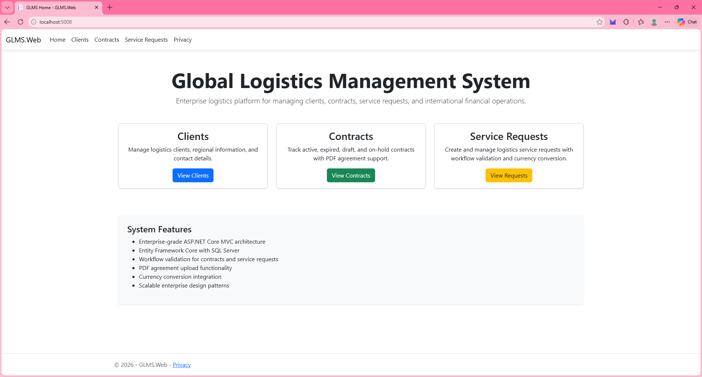
---
* Clients Management
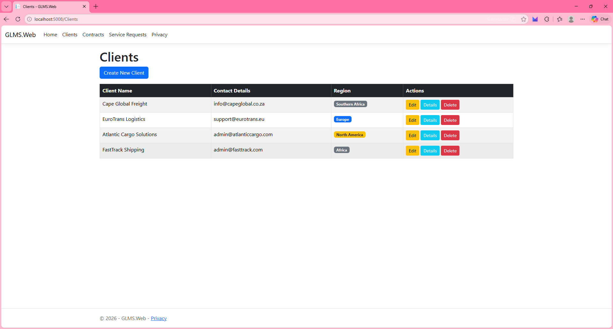
---
* Contract Management
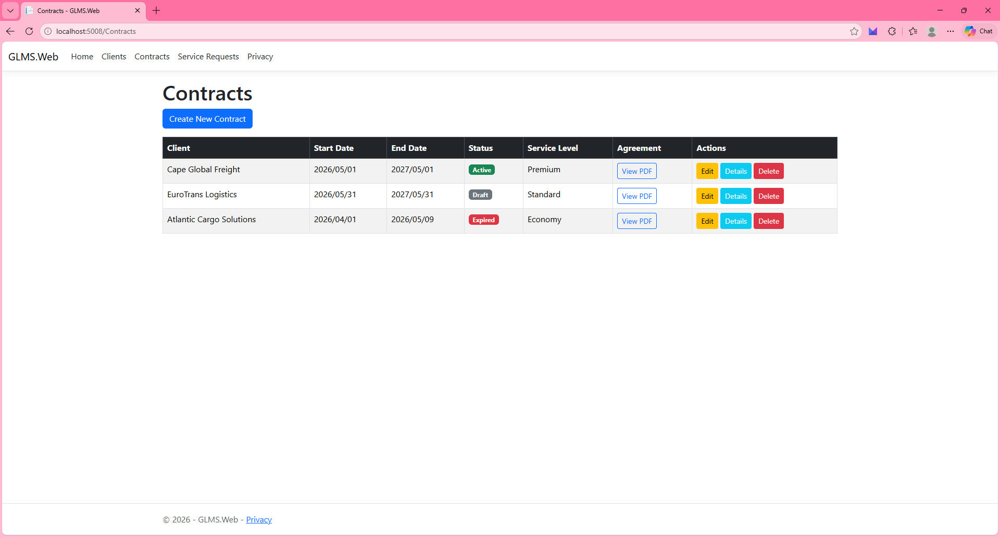
---
* PDF Upload Validation
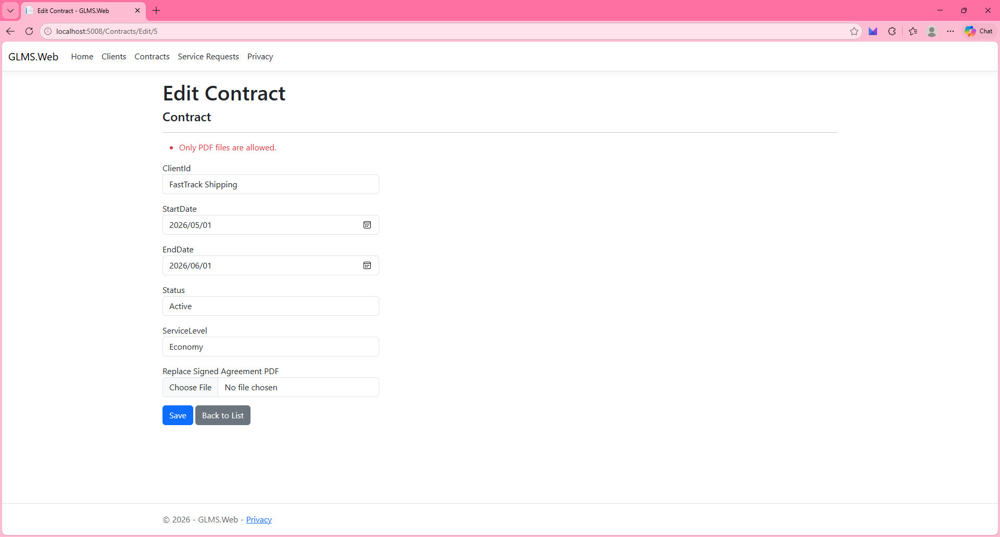
---
* Currency Conversion
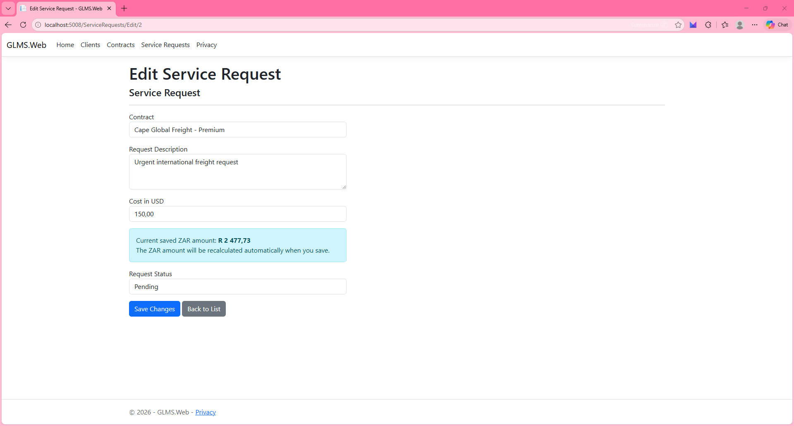
---
* Workflow Validation
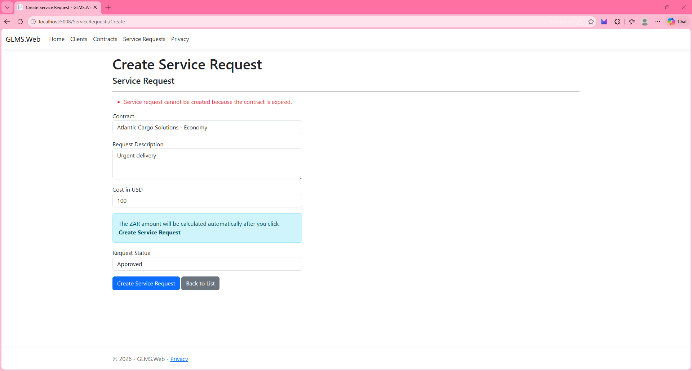
---
* Unit Testing
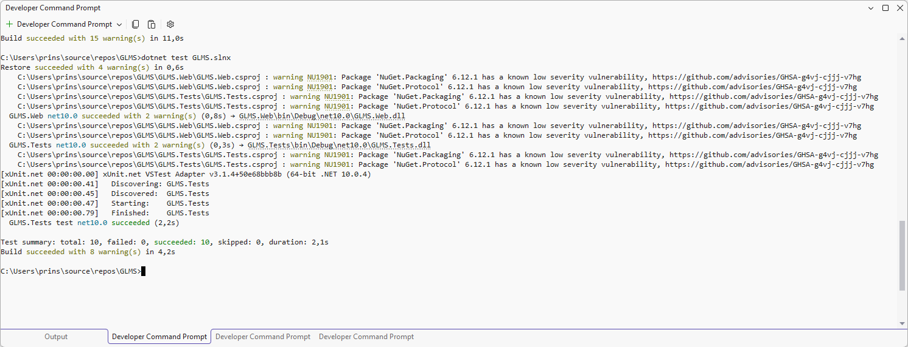
---
* GitHub Actions Pipeline
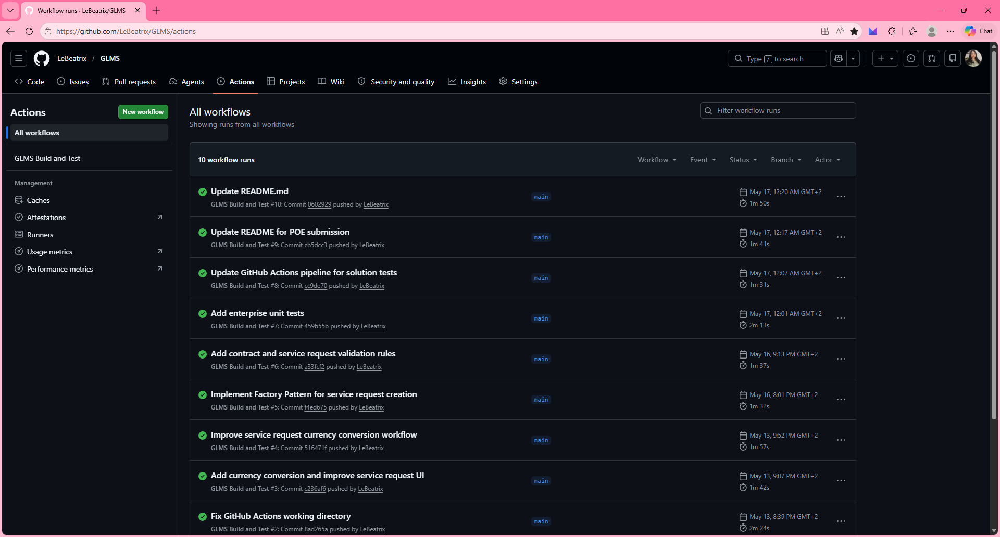
---
* GitHub Repository
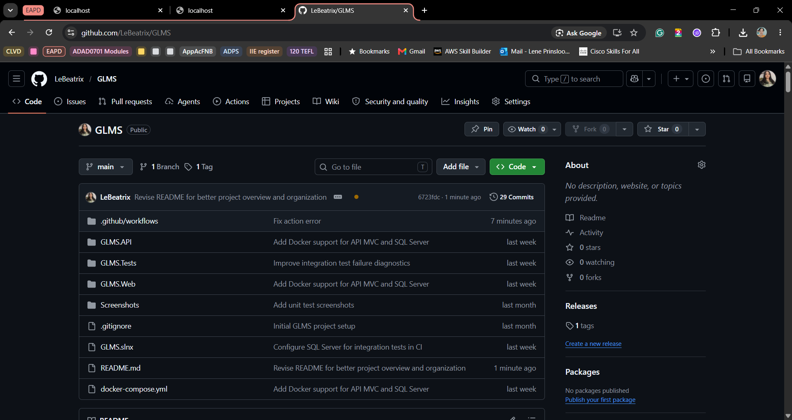
---
* Docker Containers
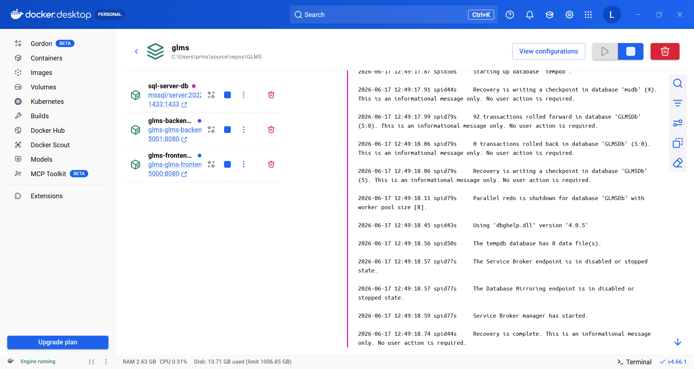
---
* Docker Compose Startup
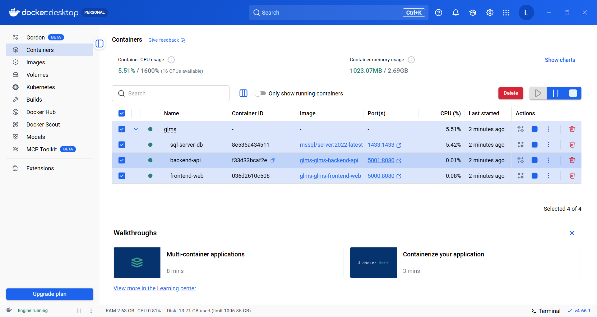
---
* Swagger API 
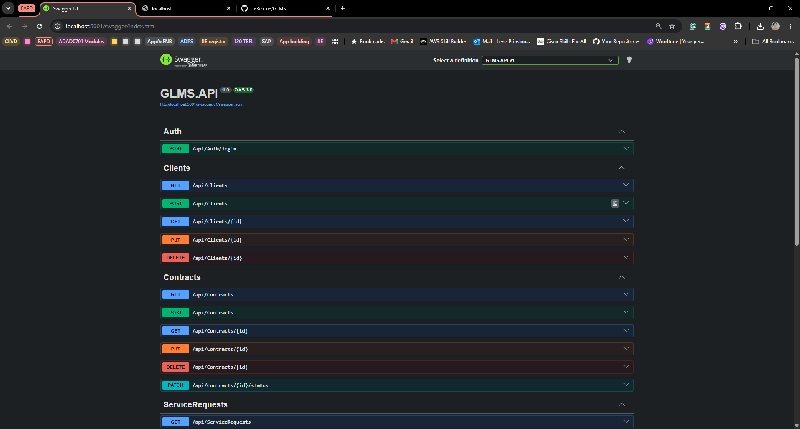
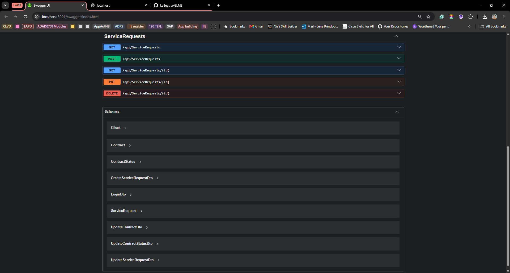
---
* JWT Authentication
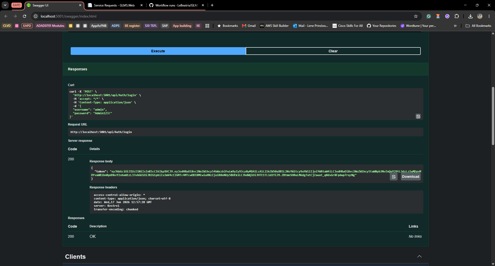
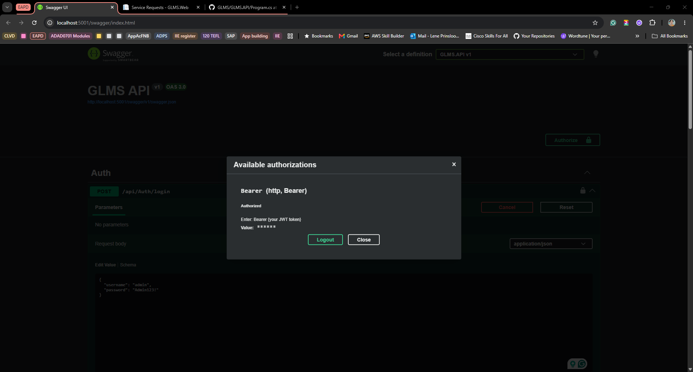
---
* Integration Tests

---

# References

Bootstrap, 2025. Bootstrap Documentation. Available at: https://getbootstrap.com/docs/

ExchangeRate API, 2025. ExchangeRate API Documentation. Available at: https://www.exchangerate-api.com/

GitHub, 2025. GitHub Actions Documentation. Available at: https://docs.github.com/actions

Microsoft, 2025. ASP.NET Core Documentation. Available at: https://learn.microsoft.com/aspnet/core

Microsoft, 2025. Entity Framework Core Documentation. Available at: https://learn.microsoft.com/ef/core

Microsoft, 2025. Dependency Injection in ASP.NET Core. Available at: https://learn.microsoft.com/aspnet/core/fundamentals/dependency-injection

Microsoft, 2025. Authentication and Authorization in ASP.NET Core. Available at: https://learn.microsoft.com/aspnet/core/security/authentication

Microsoft, 2025. Docker Support in ASP.NET Core. Available at: https://learn.microsoft.com/aspnet/core/host-and-deploy/docker

Microsoft, 2025. Unit Testing with xUnit. Available at: https://learn.microsoft.com/dotnet/core/testing/unit-testing-csharp-with-xunit

Refactoring Guru, 2025. Factory Method Pattern. Available at: https://refactoring.guru/design-patterns/factory-method

Refactoring Guru, 2025. Observer Pattern. Available at: https://refactoring.guru/design-patterns/observer

<<<<<<< HEAD
Refactoring Guru, 2025. Strategy Pattern. Available at: https://refactoring.guru/design-patterns/strategy
=======
Refactoring Guru, 2025. Strategy Pattern. Available at: https://refactoring.guru/design-patterns/strategy
>>>>>>> 6723fdca120bbdfa5b8999291ce3ab4450671bd0
